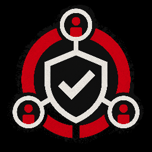

# audit-team 

**Runs a staged audit flow using scoped waves of subagents.**

**Locks the audit lens, then validates after the delegated run finishes.**

## Note

*This skill is optimized for specific, pre-configured subagents:*

- `explorer_deep`: Use escalated read-only mapping when standard exploration is insufficient, the code path spans multiple modules, or deeper local evidence is needed.
- `worker`: Use the most capable coding optimized model.
- `worker_mini`: Use a faster coding model or the most capable one with lower reasoning.
- `reviewer_heavy`: Use deep read-only review for high-reasoning audits, regressions, and security/correctness risks.
- `reviewer_mid`: Use standard read-only review for normal code review.

## How to use

1. Type `$audit-team <audit lens>`.
2. Follow the parent-led audit, mapping, triage, implementation, and validation flow.

### Examples

- `$audit-team repo wide, correctness`
- `$audit-team back-end, performance`
- `$audit-team frontend, security`

## Version

Current version: v1.5.3

## Install

`npx skills@latest add CratesSo/skills/audit-team`
